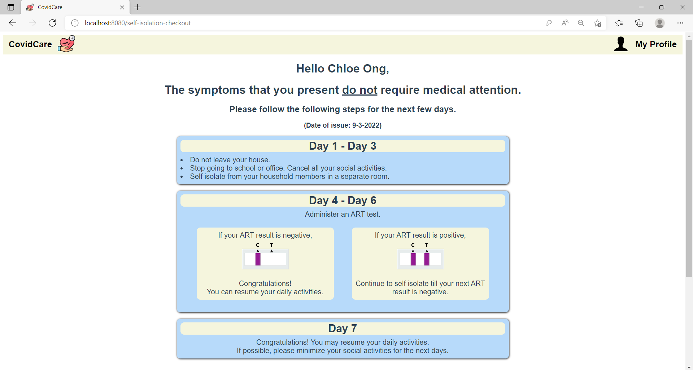

# CovidCare

This is a group project for BT3103 Application Systems Development for Business Analytics.

## Problem Statement

The trajectory of the COVID-19 pandemic has been uncertain. The COVID-19 situation has persisted for over two years, with government protocols and measures changing from time to time according to the severity of the situation. Keeping up with these mandates might be confusing and troublesome for the general public. Additionally, the Ministry of Health (MOH) reported that hospitals' emergency departments have been flooded with patients, with 80% of them having mild symptoms that do not actually
require emergency care [(CNA, 2022)](https://www.channelnewsasia.com/singapore/covid-19-hospital-emergency-department-gp-clinic-2482546).

## Features

This application, CovidCare, is designed to increase public awareness and help users better navigate through the COVID-19 pandemic. 
The features of CovidCare includes: 
 - Providing recommendations on the course of action based on users' health conditions
 - Seamless appointment booking at medical facilities _(if user is recommended to seek medical care)_
 - Access to the latest COVID-19 related information and news

_User Home Page_   
<kbd>  <kbd>

_Recommended Course of Action Page_   
<kbd>  

_Medical Appointment Booking Page_   
<kbd>  

_FAQs Page_   
<kbd>  

## Built With

 - [Vue.js](https://vuejs.org/)
